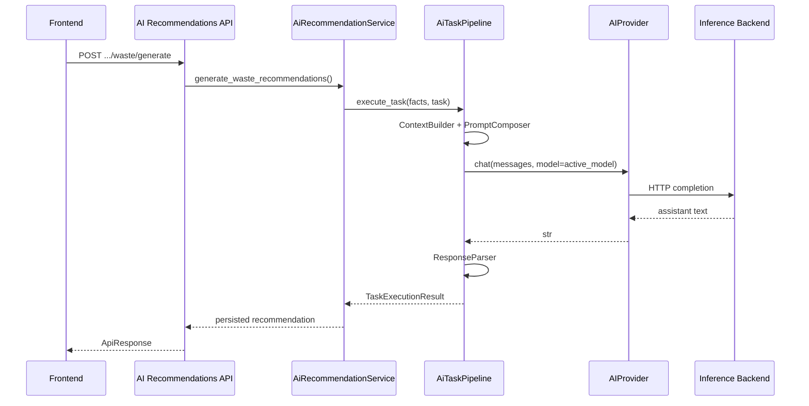
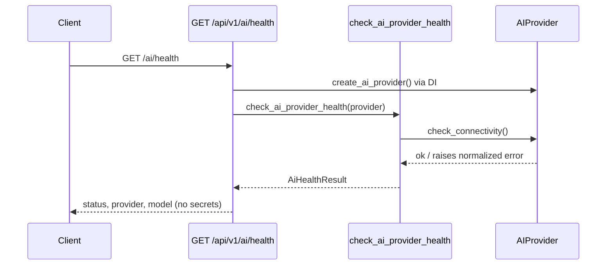

# AI Provider Architecture (Phase 10)

Khazina’s AI layer uses a **provider abstraction** so inference backends (Ollama, cloud APIs, future vendors) are swappable through configuration — without changing business logic, the prompt engine, parsers, or frontend.

---

## Architecture Overview

```
Frontend (unchanged)
        ↓
AI API  (/api/v1/ai/*, ai-recommendations routes)
        ↓
AI Service  (AiRecommendationService, AiOrchestrator)
        ↓
AI Provider Interface  (AIProvider)
        ↓
   ┌────┴────┐
OllamaProvider   CloudProvider
   ↓               ↓
 Ollama HTTP    OpenAI-compatible /chat/completions
```

Everything **above** the provider layer is provider-agnostic. Services inject an object that implements `chat()` and health probes — not a specific vendor client.

---

## Components

| Layer | Location | Role |
|-------|----------|------|
| Interface | `app/ai/providers/base.py` | `AIProvider` ABC — completion, connectivity, metadata |
| Ollama | `app/ai/providers/ollama.py` | Local Ollama (`GET /api/tags`, `POST /api/chat`) |
| Cloud | `app/ai/providers/cloud.py` | Vendor-agnostic OpenAI-compatible API |
| Factory | `app/ai/providers/factory.py` | `create_ai_provider()` — single selection point |
| Config | `app/core/config/ai.py` | `AiSettings` — env-driven provider + model + timeout |
| Health | `app/ai/health.py` | `check_ai_provider_health()` |
| DI | `app/api/deps.py` | `get_ai_provider()` / `AIProviderDep` |
| Back-compat | `app/ai/client.py` | `OllamaClient` alias → `OllamaProvider` |

### Unchanged (by design)

- Prompt Engine (`app/ai/prompts/`)
- Facts Contract (`app/business/facts/`)
- Response Parser (`app/ai/parsers/`)
- Recommendation pipeline orchestration (`app/ai_recommendations/pipeline.py` — only renamed internal `llm_*` refs)
- Risk / Waste engines, reports, simulation, database, frontend

---

## Sequence: Waste AI Recommendation



The same flow applies to Risk AI; only the domain/task and facts contract differ.

---

## Sequence: Health Check



`GET /api/v1/health` aggregates the same AI probe into the system health envelope.

---

## Configuration

All provider selection is **environment-driven**. No scattered `if provider == ...` in business code.

### Environment variables

| Variable | Required when | Description |
|----------|---------------|-------------|
| `AI_PROVIDER` | Always | `ollama` (default) or `cloud` |
| `OLLAMA_URL` | `AI_PROVIDER=ollama` | Ollama base URL |
| `OLLAMA_MODEL` | `AI_PROVIDER=ollama` | Model tag |
| `CLOUD_AI_BASE_URL` | `AI_PROVIDER=cloud` | OpenAI-compatible base (e.g. `https://api.openai.com/v1`) |
| `CLOUD_AI_MODEL` | `AI_PROVIDER=cloud` | Cloud model id |
| `CLOUD_AI_API_KEY` | `AI_PROVIDER=cloud` | Bearer token (never logged or returned in health) |
| `AI_TIMEOUT` | Optional | HTTP timeout seconds (default `30`) |
| `AI_TEMPERATURE` | Optional | Cloud sampling temperature (default `0.7`) |
| `DEFAULT_PROMPT_LANGUAGE` | Optional | Prompt language code (default `ar`) |

### Example: Ollama (default)

```env
AI_PROVIDER=ollama
OLLAMA_URL=http://localhost:11434
OLLAMA_MODEL=qwen3.5:4b
AI_TIMEOUT=180
```

### Example: Cloud (vendor selected later)

```env
AI_PROVIDER=cloud
CLOUD_AI_BASE_URL=https://api.openai.com/v1
CLOUD_AI_MODEL=gpt-4o-mini
CLOUD_AI_API_KEY=sk-...
AI_TIMEOUT=60
AI_TEMPERATURE=0.7
```

Switching vendor (OpenAI → Azure OpenAI → Gemini adapter → Claude gateway) requires only changing `CLOUD_AI_BASE_URL`, `CLOUD_AI_MODEL`, and `CLOUD_AI_API_KEY` — not application code.

---

## Provider Selection

Single factory:

```python
from app.ai.providers.factory import create_ai_provider

provider = create_ai_provider()  # reads settings.ai
text = provider.chat(messages)
```

FastAPI dependency:

```python
from app.api.deps import AIProviderDep

def route(provider: AIProviderDep): ...
```

---

## Ollama Provider

- **Health:** `GET {OLLAMA_URL}/api/tags`
- **Completion:** `POST {OLLAMA_URL}/api/chat`
- Supports `format_json` via Ollama `format: json`
- Behavior matches pre–Phase 10 `OllamaClient`

`OllamaClient` remains as a backward-compatible alias for tests and legacy imports.

---

## Cloud Provider

- **Health:** `GET {CLOUD_AI_BASE_URL}/models` (falls back to base URL on 404)
- **Completion:** `POST {CLOUD_AI_BASE_URL}/chat/completions`
- **Auth:** `Authorization: Bearer {CLOUD_AI_API_KEY}`
- **JSON mode:** `response_format: { type: json_object }` when `format_json=True`
- **Errors:** normalized to `AIConnectionError`, `AITimeoutError`, `AIConfigurationError`

No vendor-specific SDKs. Any OpenAI-compatible endpoint works.

---

## Health API Response

`GET /api/v1/ai/health`:

```json
{
  "success": true,
  "data": {
    "status": "ok",
    "provider": "ollama",
    "provider_reachable": true,
    "ollama_reachable": true,
    "configured_model": "qwen3.5:4b",
    "message": "ollama provider is reachable"
  }
}
```

- `ollama_reachable` is retained for frontend compatibility. When the active provider is reachable, it is `true` regardless of whether the backend is Ollama or cloud (legacy field name).
- API keys are never exposed.

---

## Migration Guide

### From pre–Phase 10 (Ollama-only)

1. No code changes required for Ollama deployments.
2. Add `AI_PROVIDER=ollama` explicitly (optional; default is `ollama`).
3. Keep existing `OLLAMA_URL`, `OLLAMA_MODEL`, `AI_TIMEOUT`.

### To cloud inference

1. Set `AI_PROVIDER=cloud`.
2. Configure `CLOUD_AI_BASE_URL`, `CLOUD_AI_MODEL`, `CLOUD_AI_API_KEY`.
3. Restart the API process.
4. Verify `GET /api/v1/ai/health` shows `provider: cloud` and `status: ok`.
5. Run waste/risk AI generation smoke tests.

### Rollback

Set `AI_PROVIDER=ollama` and restart. No database migration.

---

## Operational Guide

### Verify provider at runtime

```bash
curl -s http://localhost:8000/api/v1/ai/health | jq .
```

### Common failures

| Symptom | Likely cause |
|---------|----------------|
| `OLLAMA_URL is required` | `AI_PROVIDER=ollama` but URL missing |
| `CLOUD_AI_API_KEY is required` | `AI_PROVIDER=cloud` without key |
| `unavailable` + timeout | Increase `AI_TIMEOUT` or check network |
| 401 from cloud | Invalid or expired API key |

### Switching models

- Ollama: change `OLLAMA_MODEL`, pull model in Ollama.
- Cloud: change `CLOUD_AI_MODEL` only.

### Security

- `CLOUD_AI_API_KEY` is forbidden in org settings patches (`FORBIDDEN_SETTINGS_KEYS`).
- Health endpoints never return secrets.

---

## Testing

Provider unit tests: `tests/ai/test_providers.py`

Covers:

- Factory selection (`ollama` / `cloud`)
- Ollama and cloud completion parsing
- Timeout / connection error normalization
- Health metadata (provider name, model, no secrets)

Full regression:

```bash
cd backend
pytest
```

Existing AI recommendation and orchestrator tests use mocked `.chat()` clients and require no changes.

---

## Definition of Done (Phase 10)

- [x] `AIProvider` abstraction
- [x] `OllamaProvider` — identical Ollama behavior
- [x] `CloudProvider` — OpenAI-compatible, vendor-agnostic
- [x] `AI_PROVIDER` configuration switch
- [x] Business logic, prompt engine, frontend unchanged
- [x] Health reports provider + model without secrets
- [x] Provider tests + full regression
- [x] This document

**Quality metric:** Switching between Ollama, OpenAI, Claude, Gemini, Azure OpenAI, or future providers requires configuration changes only — not business logic rewrites.
