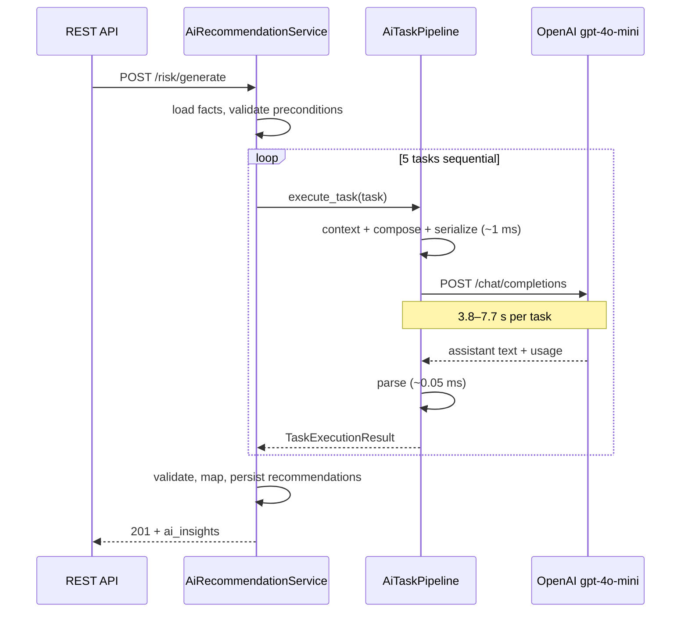

# Cloud AI Performance Analysis

**Date:** 2026-07-16  
**Provider:** Cloud (OpenAI-compatible)  
**Model:** `gpt-4o-mini`  
**Environment:** Local backend, `AI_PROVIDER=cloud`, `AI_TIMEOUT=120`, `AI_TEMPERATURE=0.2`

This document captures **measurement evidence only**. No optimizations were applied.

---

## Executive Summary

| Finding | Evidence |
|---------|----------|
| **Primary bottleneck** | Waiting for OpenAI API responses (~**99%** of wall time) |
| **Task execution** | **Sequential** — tasks run one after another in a `for` loop |
| **Parallelization** | **Likely safe** — tasks share the same facts contract; no task reads prior LLM output |
| **Prompt size** | **Not excessive** — ~830–1,045 prompt tokens per task (~2.6–3.1 KB user content) |
| **Local processing** | **Negligible** — prompt build, serialization, parsing combined **< 2 ms** per task |
| **DB persistence** | **Minor** — full service vs LLM-only delta ~**5–6 s** on risk (includes variance) |

**Observed end-to-end times:**

| Domain | Tasks | Pipeline (instrumented) | Full service (DB + persistence) |
|--------|-------|-------------------------|----------------------------------|
| Risk | 5 | **31.0 s** | **36.7 s** |
| Waste | 3 | **32.5 s** | **18.2 s** (production run; smaller facts) |

The ~1 minute user experience on **risk** aligns with **5 sequential OpenAI calls** averaging **~6 s** each, plus validation, mapping, and DB writes.

---

## Methodology

### Instrumentation script

`backend/scripts/measure_cloud_ai_performance.py` — measures each pipeline stage per task using the **production code path** (`ContextBuilder`, `PromptComposer`, `CloudProvider`, `ResponseParser`) without modifying business services.

Stages timed per task:

1. **Context build** (facts → prompt context)
2. **Prompt compose** (system + user prompts)
3. **Serialization** (`json.dumps` payload size)
4. **HTTP request → OpenAI response** (API latency + token usage from `usage` field)
5. **Parsing** (`ResponseParser`)

### End-to-end service runs

Direct calls to `AiRecommendationService.generate_*` against the local PostgreSQL database with real completed analysis runs:

- **Risk:** run `7b7934aa-…`, `regenerate=true`
- **Waste:** run `84b91f04-…`, first-time generation

### Raw data

Full JSON output: `backend/scripts/_cloud_ai_perf.json`

---

## Request Timeline (Risk Domain — Representative)

One risk AI generation request (`generate_risk_recommendations`):

```
Start request                                    0 ms
        ↓
Load facts + preflight (DB, validation)         ~50–200 ms  (estimated; not LLM-bound)
        ↓
┌── Task 1: Executive Summary ─────────────────────────────────────────┐
│  Prompt construction (context + compose)          ~0.08 ms           │
│  Serialization (JSON payload)                     ~0.05 ms           │
│  HTTP request sent → OpenAI response received     5,919 ms           │
│  Parsing                                          ~0.04 ms           │
└──────────────────────────────────────────────────────────────────────┘
        ↓  (sequential — waits for task 1 to finish)
┌── Task 2: Executive Brief ───────────────────────────────────────────┐
│  Prompt construction                              ~0.12 ms           │
│  Serialization                                    ~0.06 ms           │
│  OpenAI API                                       3,788 ms           │
│  Parsing                                          ~0.05 ms           │
└──────────────────────────────────────────────────────────────────────┘
        ↓
┌── Task 3: Explanation ───────────────────────────────────────────────┐
│  OpenAI API                                       7,068 ms           │
└──────────────────────────────────────────────────────────────────────┘
        ↓
┌── Task 4: Mitigation ────────────────────────────────────────────────┐
│  OpenAI API                                       7,744 ms           │
└──────────────────────────────────────────────────────────────────────┘
        ↓
┌── Task 5: Board Report ──────────────────────────────────────────────┐
│  OpenAI API                                       6,264 ms           │
└──────────────────────────────────────────────────────────────────────┘
        ↓
Validation + mapper + recommendation persistence   ~5,700 ms  (risk E2E delta)
        ↓
API response returned                              ~36,700 ms total
```



---

## Per-Task Measurements (Risk — 5 Tasks, Sequential)

Measured: 2026-07-16T17:32:42Z | Total pipeline: **31,042 ms**

| Task | Prompt tokens | Completion tokens | API latency | Total task latency | Payload size |
|------|---------------|-------------------|-------------|-------------------|--------------|
| Executive Summary | 993 | 311 | **5,919 ms** | 6,176 ms | 4,678 B |
| Executive Brief | 938 | 259 | **3,788 ms** | 3,788 ms | 4,296 B |
| Explanation | 964 | 401 | **7,068 ms** | 7,069 ms | 4,460 B |
| Mitigation | 1,042 | 479 | **7,744 ms** | 7,745 ms | 4,754 B |
| Board Report | 959 | 421 | **6,264 ms** | 6,264 ms | 4,396 B |
| **Sum** | **4,896** | **1,871** | **30,783 ms** | **31,042 ms** | — |

**Local stage breakdown (all 5 tasks combined):**

| Stage | Total time |
|-------|------------|
| Context build + prompt compose + serialization | **1.16 ms** |
| OpenAI API wait | **30,783 ms** (99.2%) |
| Response parsing | **0.22 ms** |

---

## Per-Task Measurements (Waste — 3 Tasks, Sequential)

Measured: 2026-07-16T17:33:13Z | Total pipeline: **32,523 ms**

| Task | Prompt tokens | Completion tokens | API latency | Total task latency | Payload size |
|------|---------------|-------------------|-------------|-------------------|--------------|
| Executive Summary | 838 | 256 | **5,483 ms** | 5,679 ms | 3,832 B |
| Recommendations | 1,045 | 395 | **17,707 ms** | 17,708 ms | 4,652 B |
| Risk Analysis | 831 | 578 | **9,136 ms** | 9,136 ms | 3,822 B |
| **Sum** | **2,714** | **1,229** | **32,326 ms** | **32,523 ms** | — |

**Local stage breakdown (all 3 tasks combined):**

| Stage | Total time |
|-------|------------|
| Context build + prompt compose + serialization | **0.69 ms** |
| OpenAI API wait | **32,326 ms** (99.4%) |
| Response parsing | **0.08 ms** |

**Note:** The **Recommendations** task is an outlier at **17.7 s** API latency — likely due to longer structured output generation, not prompt size (1,045 tokens is moderate).

---

## End-to-End Service Measurements (Including Persistence)

| Run | Domain | Analysis run ID | LLM tasks | Full service time | Recommendations created |
|-----|--------|-----------------|-----------|-------------------|-------------------------|
| Production DB | Waste | `84b91f04-…` | 3 | **18,236 ms** | 5 |
| Production DB | Risk | `7b7934aa-…` (regenerate) | 5 | **36,728 ms** | 5 |

**Risk E2E vs instrumented pipeline:**

- Pipeline (sample facts): 31,042 ms  
- Full service (production facts): 36,728 ms  
- **Overhead (validation + mapper + DB + variance): ~5,686 ms (~15%)**

**Waste E2E vs instrumented pipeline:**

- Pipeline (sample facts): 32,523 ms  
- Full service (production facts): 18,236 ms  

Production waste run used **smaller real-world facts** than the test fixture, so it completed faster. This confirms prompt/facts size affects latency but is secondary to API wait time.

---

## Investigation Questions

### 1. Are tasks executed sequentially?

**Yes.** Confirmed in code and by wall-clock sums matching sequential API latencies.

```383:401:Khazina/backend/app/ai_recommendations/service.py
    def _execute_risk_tasks(
        self,
        facts_contract: FactsContract,
        *,
        prompt_language: str,
        prompt_supplement: str,
    ) -> tuple[TaskExecutionResult, ...]:
        results: list[TaskExecutionResult] = []
        for task in RISK_TASK_EXECUTION_ORDER:
            results.append(
                self._pipeline.execute_task(
                    facts_contract,
                    task,
                    domain="risk",
                    prompt_language=prompt_language,
                    prompt_supplement=prompt_supplement,
                )
            )
        return tuple(results)
```

Risk order (`RISK_TASK_EXECUTION_ORDER`):

1. Executive Summary  
2. Executive Brief  
3. Explanation  
4. Mitigation  
5. Board Report  

Waste order (`TASK_EXECUTION_ORDER`): Executive Summary → Recommendations → Risk Analysis.

---

### 2. Can they safely run in parallel?

**Likely yes — from a data-dependency perspective.**

Each task receives the **same** `FactsContract` and optional `prompt_supplement`. No task consumes the LLM output of a prior task. Tasks are independent narratives derived from deterministic facts.

**Caveats before parallelizing (future work, not measured here):**

- OpenAI rate limits / concurrent request quotas  
- DB transaction ordering if persisting incrementally  
- Error handling partial-failure semantics  
- Token cost unchanged (same total tokens; wall time would drop)

---

### 3. Is prompt size excessive?

**No.** Measured prompts are moderate:

| Metric | Range (all tasks) |
|--------|---------------------|
| Prompt tokens (OpenAI `usage`) | 831 – 1,045 |
| System prompt chars | 467 (fixed) |
| User prompt chars | 2,142 – 2,652 |
| HTTP payload | 3.8 – 4.8 KB |

Prompt construction and serialization combined take **< 0.2 ms per task**. Prompt size is **not** the bottleneck.

---

### 4. What percentage of time is OpenAI vs local processing?

| Domain | OpenAI wait | Local (pre + post LLM) | Local % |
|--------|-------------|--------------------------|---------|
| Risk (5 tasks) | 30,783 ms | 259 ms | **0.8%** |
| Waste (3 tasks, sample) | 32,326 ms | 196 ms | **0.6%** |

**~99% of wall time is waiting for OpenAI.** Local processing (prompt engine, parser, serialization) is effectively zero in comparison.

---

## Bottleneck Conclusion

The real bottleneck is **sequential OpenAI API latency**, not Khazina local code:

1. **5 risk tasks × ~6 s each ≈ 30 s** — matches observed ~1 minute with persistence overhead.  
2. **Local pipeline stages** (prompt construction, serialization, parsing) total **< 2 ms** across all tasks.  
3. **Prompt token counts** (~1K per task) are reasonable for GPT-4o-mini.  
4. **Recommendations / Mitigation tasks** tend to run longest due to longer completions, not larger prompts.

### Where time is NOT spent

- Prompt Engine composition  
- Facts serialization to HTTP JSON  
- Response parsing  
- (Minor) DB persistence — single-digit seconds on risk E2E

### Highest-impact future optimization targets (analysis only — not implemented)

1. **Parallel task execution** — could reduce 5 × 6 s → ~max(6 s) ≈ **8 s** LLM phase (subject to rate limits)  
2. **Reduce task count** — product decision (fewer narratives per request)  
3. **Faster model / provider** — configuration change  
4. **Streaming** — improves perceived latency, not total completion time

---

## Reproduction

```powershell
cd Khazina/backend
.\.venv\Scripts\Activate.ps1

# Per-stage + per-task measurement (live OpenAI calls)
python scripts/measure_cloud_ai_performance.py --domain both --output scripts/_cloud_ai_perf.json
```

**Requirements:** Valid `CLOUD_AI_API_KEY` in `backend/.env`, network access to OpenAI.

---

## Appendix: Code References

| Component | File | Role |
|-----------|------|------|
| Task loop (waste) | `app/ai_recommendations/service.py` → `_execute_tasks` | Sequential 3-task loop |
| Task loop (risk) | `app/ai_recommendations/service.py` → `_execute_risk_tasks` | Sequential 5-task loop |
| Single-task pipeline | `app/ai_recommendations/pipeline.py` → `execute_task` | Prompt → LLM → parse |
| Cloud HTTP | `app/ai/providers/cloud.py` → `chat` | OpenAI `/chat/completions` |
| Risk task order | `app/ai_recommendations/risk_constants.py` | 5 task definitions |

---

*Generated from live measurements on 2026-07-16. No business logic was modified for this analysis.*
