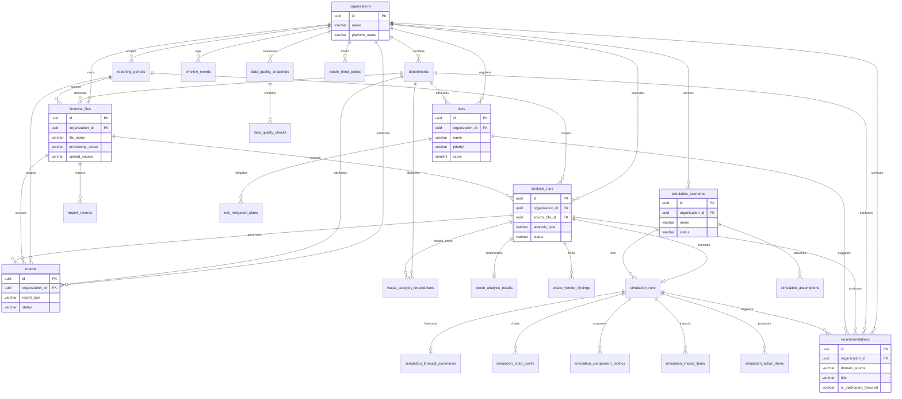

# Khazina — Database Schema Design (MVP)

**Sprint:** 3.2 — Database Schema Design  
**Status:** Approved with minor revisions (2026-07-12) — awaiting Technical Lead sign-off before Sprint 3.3 (SQLAlchemy Models)  
**Database engine:** PostgreSQL 16  
**Authority:** [BUSINESS_DOMAIN_DISCOVERY.md](BUSINESS_DOMAIN_DISCOVERY.md)

This document defines the complete relational schema for the Khazina MVP. It is a **design artifact only** — no SQL, models, or migrations are included.

---

## 1. Design Overview

The schema mirrors the six primary business domains and three cross-cutting concepts identified in the approved Business Domain Discovery. The Executive Dashboard is **not** materialized as persistent domain tables; it aggregates read-only data from other domains at query time, consistent with Domain Boundaries (Discovery §9.1).

### 1.1 Design Principles

| Principle | Application |
|---|---|
| Domain ownership | Each table has a single owning business domain |
| Organization scoping | All business data is scoped to `organizations` |
| Surrogate keys | UUID primary keys throughout |
| MVP fidelity | Schema supports frozen frontend data shapes without inventing new features |
| Extensibility | Organization, reporting period, department, and user fields allow future phases without breaking MVP |
| No auth in Phase 3 | No user/account tables; owner fields are text labels |

### 1.2 Entity Count Summary

| Domain | Entities |
|---|---|
| Organization Context | 2 |
| Departmental Context | 1 |
| Financial Data Repository | 3 |
| Analysis (shared) | 1 |
| Financial Waste Detection | 4 |
| Enterprise Risk Management | 2 |
| Business Scenario Simulation | 6 |
| Executive Reporting | 1 |
| AI Recommendations (cross-cutting) | 1 |
| Executive Timeline (cross-cutting) | 1 |
| **Total** | **22** |

---

## 2. Resolved Architectural Decisions

The discovery document listed ten decisions pending Technical Lead approval. This design resolves each with rationale. Any decision marked **Ambiguity retained** should be confirmed by the Technical Lead before Sprint 3.3.

| # | Discovery decision | Schema resolution | Rationale |
|---|---|---|---|
| 1 | Financial file ingestion architecture | **Unified `financial_files` entity** with `upload_source` discriminator (`repository`, `waste_analysis`) | Files are the central artifact (Discovery §6.3, §8.4). One canonical inventory owned by Data Repository; upload channel is metadata, not a separate domain. |
| 2 | Department reference model | **Governed reference table `departments`** | Departments appear across all domains. A shared reference set resolves frontend inconsistency without introducing department management UI. |
| 3 | Recommendation ownership model | **Centralized `recommendations` table** with `domain_source` | Resolves ID overlap (`rec-w01` on Dashboard and Waste). Supports cross-domain surfacing including Dashboard top-3. |
| 4 | Risk owner attribution | **`owner_label` text field** on risks and mitigation plans | MVP scope: display attributes only (Discovery §4.2). User FK deferred until User Management is introduced. |
| 5 | Analysis vs report boundary | **Distinct entities:** `analysis_runs` (process) and `reports` (published artifact) | Different lifecycles: analyses can complete without a report; reports can reference source analyses optionally. |
| 6 | Vendor concept scope | **`waste_vendor_findings` scoped to waste analysis runs** | Vendor master data is explicitly absent (Discovery §4). Vendors exist only as waste findings. |
| 7 | Simulation scenario lifecycle | **`simulation_scenarios.status`** supports `draft`, `completed`; **`simulation_runs`** captures execution | Matches frontend statuses (مسودة/مكتمل). Scenario authoring UI disabled in MVP but lifecycle states preserved. |
| 8 | Reporting period scope | **`reporting_periods` table** with `is_active` flag | MVP uses one active period; schema supports multiple periods without period-selection UI. |
| 9 | Waste upload vs repository registration | **Waste uploads create `financial_files` rows**; waste analysis runs FK to file | Architectural coupling: every analysis references canonical file inventory. |
| 10 | Documentation authority | **Frozen frontend + approved discovery remain authority** | This design document references placeholder data shapes; stale ARCHITECTURE.md frontend section not used. |

---

## 3. Entity Identification

### 3.1 Organization Context

#### `organizations`

| Aspect | Detail |
|---|---|
| **Purpose** | Represents the organizational context within which all Khazina data is interpreted |
| **Business responsibility** | Stores organization identity displayed globally (name, platform name) |
| **Ownership** | Organization Context (not Organization Management — no admin workflows in MVP) |
| **Lifecycle** | Created at deployment/seed; updated rarely; never deleted in MVP |

#### `reporting_periods`

| Aspect | Detail |
|---|---|
| **Purpose** | Defines the time scope for financial reporting and analysis |
| **Business responsibility** | Holds period label (e.g., الربع الثاني 2026) and active-period designation |
| **Ownership** | Organization Context |
| **Lifecycle** | Created per fiscal/reporting period; one marked active; historical periods retained |

---

### 3.2 Departmental Context

#### `departments`

| Aspect | Detail |
|---|---|
| **Purpose** | Canonical department reference for filtering, attribution, and breakdowns |
| **Business responsibility** | Governed list of organizational departments used across domains |
| **Ownership** | Departmental Context (reference data only — no department management UI) |
| **Lifecycle** | Seeded with known departments; soft-deactivatable via `is_active`; not deleted while referenced |

**Seed departments (from discovery §5.8):** المشتريات, العمليات, الشؤون المالية, تقنية المعلومات, الموارد البشرية, الامتثال, الاستشارات

---

### 3.3 Financial Data Repository

#### `financial_files`

| Aspect | Detail |
|---|---|
| **Purpose** | Canonical inventory of uploaded financial files |
| **Business responsibility** | Tracks file metadata, processing status, upload origin, and department association |
| **Ownership** | Financial Data Repository |
| **Lifecycle** | Created on upload → processing → terminal status (`completed`, `failed`); retained for audit and analysis reference |

#### `import_records`

| Aspect | Detail |
|---|---|
| **Purpose** | Records each import attempt for a financial file |
| **Business responsibility** | Import history with record counts and success/failure outcomes |
| **Ownership** | Financial Data Repository |
| **Lifecycle** | Created per import operation; append-only; linked to parent file |

#### `data_quality_snapshots`

| Aspect | Detail |
|---|---|
| **Purpose** | Point-in-time repository-level data validation summary |
| **Business responsibility** | Aggregated quality metrics (field completeness, budget alignment, date format, duplicates) |
| **Ownership** | Financial Data Repository |
| **Lifecycle** | Created after validation runs; new snapshot supersedes display (historical retained) |

#### `data_quality_checks`

| Aspect | Detail |
|---|---|
| **Purpose** | Individual validation check results within a snapshot |
| **Business responsibility** | Named check, result percentage, and detail text |
| **Ownership** | Financial Data Repository |
| **Lifecycle** | Created with parent snapshot; immutable |

---

### 3.4 Analysis (Shared)

#### `analysis_runs`

| Aspect | Detail |
|---|---|
| **Purpose** | Represents an analytical process executed against organizational data |
| **Business responsibility** | Tracks analysis type, title, status, source file, and completion |
| **Ownership** | Shared parent entity; extended by domain-specific result tables |
| **Lifecycle** | Created → `pending`/`processing` → `completed`/`failed`; re-analysis creates new run |

**Analysis types (enum `analysis_type`):** `financial_waste`, `risk`, `simulation`, `operational`, `human_resources`

Maps to frontend recent-analyses types: هدر مالي, مخاطر, محاكاة, تشغيلي, موارد بشرية

---

### 3.5 Financial Waste Detection

#### `waste_analysis_results`

| Aspect | Detail |
|---|---|
| **Purpose** | Summary KPIs for a completed waste analysis run |
| **Business responsibility** | Total waste, waste percentage, top category, potential savings |
| **Ownership** | Financial Waste Detection |
| **Lifecycle** | Created when waste analysis completes; 1:1 with `analysis_runs` where type = `financial_waste` |

#### `waste_category_breakdowns`

| Aspect | Detail |
|---|---|
| **Purpose** | Per-category waste amounts within an analysis |
| **Business responsibility** | Category name, amount, percentage, department attribution |
| **Ownership** | Financial Waste Detection |
| **Lifecycle** | Created with analysis results; immutable per run |

#### `waste_vendor_findings`

| Aspect | Detail |
|---|---|
| **Purpose** | Vendor deviation findings within waste analysis |
| **Business responsibility** | Vendor name, category, amount, deviation, review status |
| **Ownership** | Financial Waste Detection (vendor scoped — not master data) |
| **Lifecycle** | Created with analysis results; immutable per run |

#### `waste_trend_points`

| Aspect | Detail |
|---|---|
| **Purpose** | Monthly waste trend for chart display |
| **Business responsibility** | Organization-level waste amount by month label |
| **Ownership** | Financial Waste Detection |
| **Lifecycle** | Updated as analyses complete; scoped to organization + reporting period |

---

### 3.6 Enterprise Risk Management

#### `risks`

| Aspect | Detail |
|---|---|
| **Purpose** | Active risk register entries |
| **Business responsibility** | Risk identity, scoring, priority, department, status, matrix coordinates, owner label |
| **Ownership** | Enterprise Risk Management |
| **Lifecycle** | Created → active/processing → closed/archived; `last_updated_at` tracks changes |

**Risk statuses (enum):** `active`, `in_progress`, `closed`  
Supports frontend statuses (نشط, قيد المعالجة) and closed-risk KPI (Discovery §8.2 gap).

#### `risk_mitigation_plans`

| Aspect | Detail |
|---|---|
| **Purpose** | Mitigation actions linked to risks |
| **Business responsibility** | Plan title, description, status, target date, owner label |
| **Ownership** | Enterprise Risk Management |
| **Lifecycle** | Created → in progress/review/planned → completed |

---

### 3.7 Business Scenario Simulation

#### `simulation_scenarios`

| Aspect | Detail |
|---|---|
| **Purpose** | Catalog of what-if scenarios |
| **Business responsibility** | Scenario name, description, lifecycle status |
| **Ownership** | Business Scenario Simulation |
| **Lifecycle** | Created (draft) → completed after successful run; MVP scenarios seeded read-only |

**Scenario statuses (enum):** `draft`, `completed`

#### `simulation_assumptions`

| Aspect | Detail |
|---|---|
| **Purpose** | Read-only assumption key-value pairs for a scenario |
| **Business responsibility** | Assumption label and value display |
| **Ownership** | Business Scenario Simulation |
| **Lifecycle** | Created with scenario; updated only if scenario edited (future) |

#### `simulation_runs`

| Aspect | Detail |
|---|---|
| **Purpose** | Execution of a simulation scenario |
| **Business responsibility** | Links scenario to analysis run; stores run-level summary and confidence |
| **Ownership** | Business Scenario Simulation |
| **Lifecycle** | Created on run trigger → processing → completed |

#### `simulation_forecast_summaries`

| Aspect | Detail |
|---|---|
| **Purpose** | Baseline vs projected summary for a simulation run |
| **Business responsibility** | Baseline/projected labels and values, delta, confidence |
| **Ownership** | Business Scenario Simulation |
| **Lifecycle** | 1:1 with completed simulation run |

#### `simulation_chart_points`

| Aspect | Detail |
|---|---|
| **Purpose** | Quarterly chart data for simulation results |
| **Business responsibility** | Quarter label, baseline amount, projected amount |
| **Ownership** | Business Scenario Simulation |
| **Lifecycle** | Created with simulation run results |

#### `simulation_comparison_metrics`

| Aspect | Detail |
|---|---|
| **Purpose** | Metric-by-metric baseline vs simulated comparison |
| **Business responsibility** | Metric name, current/simulated values, change, direction |
| **Ownership** | Business Scenario Simulation |
| **Lifecycle** | Created with simulation run results |

#### `simulation_impact_items`

| Aspect | Detail |
|---|---|
| **Purpose** | Departmental or category impact breakdown |
| **Business responsibility** | Category, baseline, projected, change, direction |
| **Ownership** | Business Scenario Simulation |
| **Lifecycle** | Created with simulation run results |

#### `simulation_action_items`

| Aspect | Detail |
|---|---|
| **Purpose** | Proposed follow-up actions after simulation |
| **Business responsibility** | Action title, description, status |
| **Ownership** | Business Scenario Simulation |
| **Lifecycle** | Created with simulation run; status tracks executive review |

---

### 3.8 Executive Reporting

#### `reports`

| Aspect | Detail |
|---|---|
| **Purpose** | Published report catalog entries |
| **Business responsibility** | Report title, type, department, source file, status, executive summary |
| **Ownership** | Executive Reporting |
| **Lifecycle** | Created as draft → ready for preview/export |

**Report types (enum):** `analysis`, `risk`, `simulation`, `procurement`, `compliance`  
Maps to frontend: تحليل, مخاطر, محاكاة, مشتريات, امتثال

**Report statuses (enum):** `draft`, `ready`

---

### 3.9 Cross-Cutting

#### `recommendations`

| Aspect | Detail |
|---|---|
| **Purpose** | AI-generated actionable insights across domains |
| **Business responsibility** | Title, description, priority, confidence, optional savings and department |
| **Ownership** | AI-Assisted Recommendations (presentation layer; no AI execution in Phase 3) |
| **Lifecycle** | Created with analysis/risk/simulation outputs; surfaced on Dashboard via query |

**Domain sources (enum `recommendation_domain`):** `waste`, `risk`, `simulation`, `dashboard`

#### `timeline_events`

| Aspect | Detail |
|---|---|
| **Purpose** | Executive activity timeline entries |
| **Business responsibility** | Event date, title, type classification; optional polymorphic link to source domain entity (§4.25.1) |
| **Ownership** | Executive Timeline (presentation); may reference source domain entities |
| **Lifecycle** | Append-only; ordered by event date descending |

**Event types (enum):** `alert`, `analysis`, `review`, `system`, `report`

---

## 4. Attributes

### 4.1 `organizations`

| Field | PostgreSQL Type | Nullable | Default | Constraints |
|---|---|---|---|---|
| `id` | UUID | NOT NULL | `gen_random_uuid()` | Primary key |
| `name` | VARCHAR(255) | NOT NULL | — | Organization display name (Arabic) |
| `platform_name` | VARCHAR(100) | NOT NULL | `'خزينة'` | Product name shown in UI |
| `executive_title` | VARCHAR(255) | NULL | — | Default executive role label for MVP |
| `is_active` | BOOLEAN | NOT NULL | `true` | Only one active org expected in MVP |
| `created_at` | TIMESTAMPTZ | NOT NULL | `now()` | — |
| `updated_at` | TIMESTAMPTZ | NOT NULL | `now()` | — |

---

### 4.2 `reporting_periods`

| Field | PostgreSQL Type | Nullable | Default | Constraints |
|---|---|---|---|---|
| `id` | UUID | NOT NULL | `gen_random_uuid()` | Primary key |
| `organization_id` | UUID | NOT NULL | — | FK → `organizations.id` |
| `label` | VARCHAR(100) | NOT NULL | — | e.g., الربع الثاني 2026 |
| `start_date` | DATE | NULL | — | Optional period bounds |
| `end_date` | DATE | NULL | — | Must be ≥ `start_date` if both set |
| `is_active` | BOOLEAN | NOT NULL | `false` | At most one active per organization |
| `created_at` | TIMESTAMPTZ | NOT NULL | `now()` | — |
| `updated_at` | TIMESTAMPTZ | NOT NULL | `now()` | — |

**Business constraint:** Partial unique index — only one `is_active = true` per `organization_id`.

---

### 4.3 `departments`

| Field | PostgreSQL Type | Nullable | Default | Constraints |
|---|---|---|---|---|
| `id` | UUID | NOT NULL | `gen_random_uuid()` | Primary key |
| `organization_id` | UUID | NOT NULL | — | FK → `organizations.id` |
| `name_ar` | VARCHAR(100) | NOT NULL | — | Arabic department name |
| `code` | VARCHAR(50) | NULL | — | Optional stable code for APIs |
| `display_order` | SMALLINT | NOT NULL | `0` | Sort order in filters |
| `is_active` | BOOLEAN | NOT NULL | `true` | Soft deactivation |
| `created_at` | TIMESTAMPTZ | NOT NULL | `now()` | — |
| `updated_at` | TIMESTAMPTZ | NOT NULL | `now()` | — |

**Unique constraint:** `(organization_id, name_ar)`

---

### 4.4 `financial_files`

| Field | PostgreSQL Type | Nullable | Default | Constraints |
|---|---|---|---|---|
| `id` | UUID | NOT NULL | `gen_random_uuid()` | Primary key |
| `organization_id` | UUID | NOT NULL | — | FK → `organizations.id` |
| `department_id` | UUID | NULL | — | FK → `departments.id` |
| `reporting_period_id` | UUID | NULL | — | FK → `reporting_periods.id` |
| `file_name` | VARCHAR(500) | NOT NULL | — | Original filename |
| `storage_path` | VARCHAR(1000) | NULL | — | Object storage path (future) |
| `size_bytes` | BIGINT | NULL | — | ≥ 0 |
| `size_display` | VARCHAR(50) | NULL | — | Human-readable size for MVP parity |
| `mime_type` | VARCHAR(100) | NULL | — | e.g., application/vnd.ms-excel |
| `processing_status` | VARCHAR(50) | NOT NULL | `'pending'` | See enum below |
| `upload_source` | VARCHAR(50) | NOT NULL | `'repository'` | `repository` \| `waste_analysis` |
| `uploaded_at` | TIMESTAMPTZ | NOT NULL | `now()` | — |
| `metadata` | JSONB | NULL | — | Extensible parse/upload metadata |
| `created_at` | TIMESTAMPTZ | NOT NULL | `now()` | — |
| `updated_at` | TIMESTAMPTZ | NOT NULL | `now()` | — |

**Processing status values:** `pending`, `processing`, `completed`, `failed`, `ready_for_analysis`

Maps to frontend: مكتمل, قيد المعالجة, فشل, جاهز للتحليل

---

### 4.5 `import_records`

| Field | PostgreSQL Type | Nullable | Default | Constraints |
|---|---|---|---|---|
| `id` | UUID | NOT NULL | `gen_random_uuid()` | Primary key |
| `financial_file_id` | UUID | NOT NULL | — | FK → `financial_files.id` |
| `imported_at` | TIMESTAMPTZ | NOT NULL | `now()` | — |
| `record_count` | INTEGER | NULL | — | ≥ 0; NULL if unknown/in progress |
| `status` | VARCHAR(50) | NOT NULL | — | `success`, `failed`, `processing` |
| `error_message` | TEXT | NULL | — | Required when status = `failed` |
| `created_at` | TIMESTAMPTZ | NOT NULL | `now()` | — |

---

### 4.6 `data_quality_snapshots`

| Field | PostgreSQL Type | Nullable | Default | Constraints |
|---|---|---|---|---|
| `id` | UUID | NOT NULL | `gen_random_uuid()` | Primary key |
| `organization_id` | UUID | NOT NULL | — | FK → `organizations.id` |
| `reporting_period_id` | UUID | NULL | — | FK → `reporting_periods.id` |
| `overall_score` | NUMERIC(5,2) | NULL | — | 0.00–100.00 aggregate quality |
| `evaluated_at` | TIMESTAMPTZ | NOT NULL | `now()` | — |
| `created_at` | TIMESTAMPTZ | NOT NULL | `now()` | — |

---

### 4.7 `data_quality_checks`

| Field | PostgreSQL Type | Nullable | Default | Constraints |
|---|---|---|---|---|
| `id` | UUID | NOT NULL | `gen_random_uuid()` | Primary key |
| `snapshot_id` | UUID | NOT NULL | — | FK → `data_quality_snapshots.id` |
| `check_name` | VARCHAR(200) | NOT NULL | — | e.g., اكتمال الحقول |
| `result_percent` | NUMERIC(5,2) | NOT NULL | — | 0.00–100.00 |
| `details` | TEXT | NULL | — | Supplementary detail text |
| `display_order` | SMALLINT | NOT NULL | `0` | — |
| `created_at` | TIMESTAMPTZ | NOT NULL | `now()` | — |

---

### 4.8 `analysis_runs`

| Field | PostgreSQL Type | Nullable | Default | Constraints |
|---|---|---|---|---|
| `id` | UUID | NOT NULL | `gen_random_uuid()` | Primary key |
| `organization_id` | UUID | NOT NULL | — | FK → `organizations.id` |
| `reporting_period_id` | UUID | NULL | — | FK → `reporting_periods.id` |
| `source_file_id` | UUID | NULL | — | FK → `financial_files.id` |
| `analysis_type` | VARCHAR(50) | NOT NULL | — | Enum values listed §3.4 |
| `title` | VARCHAR(500) | NOT NULL | — | Analysis display title |
| `status` | VARCHAR(50) | NOT NULL | `'pending'` | `pending`, `processing`, `completed`, `failed` |
| `started_at` | TIMESTAMPTZ | NULL | — | Set when processing begins |
| `completed_at` | TIMESTAMPTZ | NULL | — | Set when terminal state reached |
| `runtime_metadata` | JSONB | NULL | — | Processing details, model refs (Phase 5 prep) |
| `created_at` | TIMESTAMPTZ | NOT NULL | `now()` | — |
| `updated_at` | TIMESTAMPTZ | NOT NULL | `now()` | — |

---

### 4.9 `waste_analysis_results`

| Field | PostgreSQL Type | Nullable | Default | Constraints |
|---|---|---|---|---|
| `id` | UUID | NOT NULL | `gen_random_uuid()` | Primary key |
| `analysis_run_id` | UUID | NOT NULL | — | FK → `analysis_runs.id`; UNIQUE |
| `total_waste_amount` | NUMERIC(18,2) | NOT NULL | — | ≥ 0 |
| `waste_percentage` | NUMERIC(5,2) | NOT NULL | — | 0.00–100.00 |
| `top_category_name` | VARCHAR(200) | NULL | — | Highest waste category label |
| `top_category_percentage` | NUMERIC(5,2) | NULL | — | — |
| `potential_savings_amount` | NUMERIC(18,2) | NULL | — | ≥ 0 |
| `active_savings_opportunities` | SMALLINT | NULL | — | ≥ 0 |
| `created_at` | TIMESTAMPTZ | NOT NULL | `now()` | — |

---

### 4.10 `waste_category_breakdowns`

| Field | PostgreSQL Type | Nullable | Default | Constraints |
|---|---|---|---|---|
| `id` | UUID | NOT NULL | `gen_random_uuid()` | Primary key |
| `analysis_run_id` | UUID | NOT NULL | — | FK → `analysis_runs.id` |
| `department_id` | UUID | NULL | — | FK → `departments.id` |
| `category_name` | VARCHAR(200) | NOT NULL | — | — |
| `amount` | NUMERIC(18,2) | NOT NULL | — | ≥ 0 |
| `percentage` | NUMERIC(5,2) | NOT NULL | — | 0.00–100.00 |
| `display_order` | SMALLINT | NOT NULL | `0` | — |
| `created_at` | TIMESTAMPTZ | NOT NULL | `now()` | — |

---

### 4.11 `waste_vendor_findings`

| Field | PostgreSQL Type | Nullable | Default | Constraints |
|---|---|---|---|---|
| `id` | UUID | NOT NULL | `gen_random_uuid()` | Primary key |
| `analysis_run_id` | UUID | NOT NULL | — | FK → `analysis_runs.id` |
| `vendor_name` | VARCHAR(300) | NOT NULL | — | Display name; not master data |
| `category_label` | VARCHAR(100) | NULL | — | e.g., الموردون, تقنية |
| `amount` | NUMERIC(18,2) | NOT NULL | — | ≥ 0 |
| `deviation_label` | VARCHAR(20) | NULL | — | e.g., +18% |
| `status` | VARCHAR(50) | NOT NULL | — | e.g., يتطلب مراجعة, حرج |
| `created_at` | TIMESTAMPTZ | NOT NULL | `now()` | — |

---

### 4.12 `waste_trend_points`

| Field | PostgreSQL Type | Nullable | Default | Constraints |
|---|---|---|---|---|
| `id` | UUID | NOT NULL | `gen_random_uuid()` | Primary key |
| `organization_id` | UUID | NOT NULL | — | FK → `organizations.id` |
| `reporting_period_id` | UUID | NULL | — | FK → `reporting_periods.id` |
| `month_label` | VARCHAR(50) | NOT NULL | — | Arabic month name |
| `month_order` | SMALLINT | NOT NULL | — | Sort key within period |
| `waste_amount` | NUMERIC(18,2) | NOT NULL | — | ≥ 0 |
| `created_at` | TIMESTAMPTZ | NOT NULL | `now()` | — |
| `updated_at` | TIMESTAMPTZ | NOT NULL | `now()` | — |

**Unique constraint:** `(organization_id, reporting_period_id, month_label)`

---

### 4.13 `risks`

| Field | PostgreSQL Type | Nullable | Default | Constraints |
|---|---|---|---|---|
| `id` | UUID | NOT NULL | `gen_random_uuid()` | Primary key |
| `organization_id` | UUID | NOT NULL | — | FK → `organizations.id` |
| `department_id` | UUID | NULL | — | FK → `departments.id` |
| `reporting_period_id` | UUID | NULL | — | FK → `reporting_periods.id` |
| `name` | VARCHAR(300) | NOT NULL | — | — |
| `description` | TEXT | NOT NULL | — | — |
| `priority` | VARCHAR(50) | NOT NULL | — | `high`, `medium`, `low` |
| `score` | SMALLINT | NOT NULL | — | 0–100 |
| `status` | VARCHAR(50) | NOT NULL | `'active'` | `active`, `in_progress`, `closed` |
| `owner_label` | VARCHAR(200) | NULL | — | Display-only owner; user FK deferred until User Management is introduced |
| `likelihood` | VARCHAR(50) | NULL | — | `low`, `medium`, `high` |
| `impact` | VARCHAR(50) | NULL | — | `low`, `medium`, `high` |
| `category_label` | VARCHAR(100) | NULL | — | e.g., مالي, تشغيلي (chart grouping) |
| `last_updated_at` | DATE | NOT NULL | — | — |
| `created_at` | TIMESTAMPTZ | NOT NULL | `now()` | — |
| `updated_at` | TIMESTAMPTZ | NOT NULL | `now()` | — |

---

### 4.14 `risk_mitigation_plans`

| Field | PostgreSQL Type | Nullable | Default | Constraints |
|---|---|---|---|---|
| `id` | UUID | NOT NULL | `gen_random_uuid()` | Primary key |
| `risk_id` | UUID | NOT NULL | — | FK → `risks.id` |
| `title` | VARCHAR(300) | NOT NULL | — | — |
| `description` | TEXT | NOT NULL | — | — |
| `status` | VARCHAR(50) | NOT NULL | — | e.g., قيد التنفيذ, مخطط |
| `target_date` | DATE | NOT NULL | — | — |
| `owner_label` | VARCHAR(200) | NULL | — | Display-only owner; user FK deferred until User Management is introduced |
| `created_at` | TIMESTAMPTZ | NOT NULL | `now()` | — |
| `updated_at` | TIMESTAMPTZ | NOT NULL | `now()` | — |

---

### 4.15 `simulation_scenarios`

| Field | PostgreSQL Type | Nullable | Default | Constraints |
|---|---|---|---|---|
| `id` | UUID | NOT NULL | `gen_random_uuid()` | Primary key |
| `organization_id` | UUID | NOT NULL | — | FK → `organizations.id` |
| `name` | VARCHAR(300) | NOT NULL | — | — |
| `description` | TEXT | NOT NULL | — | — |
| `status` | VARCHAR(50) | NOT NULL | `'draft'` | `draft`, `completed` |
| `created_at` | TIMESTAMPTZ | NOT NULL | `now()` | — |
| `updated_at` | TIMESTAMPTZ | NOT NULL | `now()` | — |

---

### 4.16 `simulation_assumptions`

| Field | PostgreSQL Type | Nullable | Default | Constraints |
|---|---|---|---|---|
| `id` | UUID | NOT NULL | `gen_random_uuid()` | Primary key |
| `scenario_id` | UUID | NOT NULL | — | FK → `simulation_scenarios.id` |
| `label` | VARCHAR(200) | NOT NULL | — | — |
| `value` | VARCHAR(500) | NOT NULL | — | — |
| `display_order` | SMALLINT | NOT NULL | `0` | — |
| `created_at` | TIMESTAMPTZ | NOT NULL | `now()` | — |

---

### 4.17 `simulation_runs`

| Field | PostgreSQL Type | Nullable | Default | Constraints |
|---|---|---|---|---|
| `id` | UUID | NOT NULL | `gen_random_uuid()` | Primary key |
| `scenario_id` | UUID | NOT NULL | — | FK → `simulation_scenarios.id` |
| `analysis_run_id` | UUID | NOT NULL | — | FK → `analysis_runs.id`; UNIQUE |
| `result_title` | VARCHAR(300) | NULL | — | Summary headline |
| `result_description` | TEXT | NULL | — | Summary narrative |
| `confidence_label` | VARCHAR(20) | NULL | — | e.g., 88% |
| `created_at` | TIMESTAMPTZ | NOT NULL | `now()` | — |

---

### 4.18 `simulation_forecast_summaries`

| Field | PostgreSQL Type | Nullable | Default | Constraints |
|---|---|---|---|---|
| `id` | UUID | NOT NULL | `gen_random_uuid()` | Primary key |
| `simulation_run_id` | UUID | NOT NULL | — | FK → `simulation_runs.id`; UNIQUE |
| `baseline_label` | VARCHAR(100) | NOT NULL | — | — |
| `baseline_value` | VARCHAR(100) | NOT NULL | — | Presentation-only display field (see §4.18.1) |
| `projected_label` | VARCHAR(100) | NOT NULL | — | — |
| `projected_value` | VARCHAR(100) | NOT NULL | — | Presentation-only display field (see §4.18.1) |
| `delta_label` | VARCHAR(100) | NOT NULL | — | — |
| `delta_value` | VARCHAR(100) | NOT NULL | — | Presentation-only display field (see §4.18.1) |
| `confidence_label` | VARCHAR(20) | NULL | — | — |
| `created_at` | TIMESTAMPTZ | NOT NULL | `now()` | — |

#### 4.18.1 Architectural intent — forecast display values

The fields `baseline_value`, `projected_value`, and `delta_value` in `simulation_forecast_summaries` are **presentation-only display fields**. They are not intended as canonical business data.

| Classification | Fields | Role |
|---|---|---|
| Presentation-only | `baseline_value`, `projected_value`, `delta_value` | Pre-formatted strings matching frozen frontend display (e.g., 48.75M ر.س, -10.0%) |
| Business data | `simulation_chart_points.baseline_amount`, `simulation_chart_points.projected_amount` | Numeric amounts used for charts and calculations |
| Labels | `baseline_label`, `projected_label`, `delta_label` | Display captions (الأساس, المتوقع, التغير) |

**Why this trade-off was selected:** The frozen frontend serves pre-formatted Arabic currency and percentage strings in forecast summary cards. Storing these display values ensures MVP API responses match the UI without locale-specific formatting logic in the data layer. Numeric business data is retained separately in `simulation_chart_points` where chart rendering requires precise amounts.

**Implication:** Aggregations, comparisons, and cross-domain calculations must use numeric fields — not the VARCHAR display values in `simulation_forecast_summaries`.

---

### 4.19 `simulation_chart_points`

| Field | PostgreSQL Type | Nullable | Default | Constraints |
|---|---|---|---|---|
| `id` | UUID | NOT NULL | `gen_random_uuid()` | Primary key |
| `simulation_run_id` | UUID | NOT NULL | — | FK → `simulation_runs.id` |
| `quarter_label` | VARCHAR(50) | NOT NULL | — | e.g., Q3 2026 |
| `quarter_order` | SMALLINT | NOT NULL | — | Sort key |
| `baseline_amount` | NUMERIC(18,2) | NOT NULL | — | — |
| `projected_amount` | NUMERIC(18,2) | NOT NULL | — | — |
| `created_at` | TIMESTAMPTZ | NOT NULL | `now()` | — |

---

### 4.20 `simulation_comparison_metrics`

| Field | PostgreSQL Type | Nullable | Default | Constraints |
|---|---|---|---|---|
| `id` | UUID | NOT NULL | `gen_random_uuid()` | Primary key |
| `simulation_run_id` | UUID | NOT NULL | — | FK → `simulation_runs.id` |
| `metric_name` | VARCHAR(200) | NOT NULL | — | — |
| `current_value` | VARCHAR(100) | NOT NULL | — | Presentation-only display field |
| `simulated_value` | VARCHAR(100) | NOT NULL | — | Presentation-only display field |
| `change_value` | VARCHAR(100) | NOT NULL | — | Presentation-only display field |
| `direction` | VARCHAR(20) | NOT NULL | — | `up`, `down`, `neutral` |
| `display_order` | SMALLINT | NOT NULL | `0` | — |
| `created_at` | TIMESTAMPTZ | NOT NULL | `now()` | — |

---

### 4.21 `simulation_impact_items`

| Field | PostgreSQL Type | Nullable | Default | Constraints |
|---|---|---|---|---|
| `id` | UUID | NOT NULL | `gen_random_uuid()` | Primary key |
| `simulation_run_id` | UUID | NOT NULL | — | FK → `simulation_runs.id` |
| `category_label` | VARCHAR(200) | NOT NULL | — | Department or impact category |
| `baseline_value` | VARCHAR(100) | NOT NULL | — | Presentation-only display field |
| `projected_value` | VARCHAR(100) | NOT NULL | — | Presentation-only display field |
| `change_value` | VARCHAR(100) | NOT NULL | — | Presentation-only display field |
| `direction` | VARCHAR(20) | NOT NULL | — | `up`, `down`, `neutral` |
| `display_order` | SMALLINT | NOT NULL | `0` | — |
| `created_at` | TIMESTAMPTZ | NOT NULL | `now()` | — |

---

### 4.22 `simulation_action_items`

| Field | PostgreSQL Type | Nullable | Default | Constraints |
|---|---|---|---|---|
| `id` | UUID | NOT NULL | `gen_random_uuid()` | Primary key |
| `simulation_run_id` | UUID | NOT NULL | — | FK → `simulation_runs.id` |
| `title` | VARCHAR(300) | NOT NULL | — | — |
| `description` | TEXT | NOT NULL | — | — |
| `status` | VARCHAR(50) | NOT NULL | `'proposed'` | e.g., مقترح |
| `created_at` | TIMESTAMPTZ | NOT NULL | `now()` | — |

---

### 4.23 `reports`

| Field | PostgreSQL Type | Nullable | Default | Constraints |
|---|---|---|---|---|
| `id` | UUID | NOT NULL | `gen_random_uuid()` | Primary key |
| `organization_id` | UUID | NOT NULL | — | FK → `organizations.id` |
| `department_id` | UUID | NULL | — | FK → `departments.id` |
| `reporting_period_id` | UUID | NULL | — | FK → `reporting_periods.id` |
| `source_file_id` | UUID | NULL | — | FK → `financial_files.id` |
| `analysis_run_id` | UUID | NULL | — | FK → `analysis_runs.id` |
| `title` | VARCHAR(500) | NOT NULL | — | — |
| `report_type` | VARCHAR(50) | NOT NULL | — | Enum §3.8 |
| `status` | VARCHAR(50) | NOT NULL | `'draft'` | `draft`, `ready` |
| `summary` | TEXT | NOT NULL | — | Executive summary text (see §4.23.1) |
| `published_at` | DATE | NULL | — | Report date shown in UI |
| `created_at` | TIMESTAMPTZ | NOT NULL | `now()` | — |
| `updated_at` | TIMESTAMPTZ | NOT NULL | `now()` | — |

#### 4.23.1 Field naming — `summary`

The field is named **`summary`** rather than `preview_text` because it stores the **executive summary content** of the report — the business meaning described in the discovery document (Discovery §5.6: "executive summary text"). The name `preview_text` describes the UI presentation context (preview card) rather than the data itself.

The frozen frontend placeholder uses `previewText` as a component property name. That is a presentation-layer alias; the persisted business attribute is the report's executive summary. The API layer may map `summary` → `previewText` for MVP frontend parity without changing the semantic model.

---

### 4.24 `recommendations`

| Field | PostgreSQL Type | Nullable | Default | Constraints |
|---|---|---|---|---|
| `id` | UUID | NOT NULL | `gen_random_uuid()` | Primary key |
| `organization_id` | UUID | NOT NULL | — | FK → `organizations.id` |
| `domain_source` | VARCHAR(50) | NOT NULL | — | `waste`, `risk`, `simulation`, `dashboard` |
| `external_ref` | VARCHAR(50) | NULL | — | Legacy placeholder ID (rec-w01) |
| `title` | VARCHAR(500) | NOT NULL | — | — |
| `description` | TEXT | NOT NULL | — | — |
| `priority` | VARCHAR(50) | NOT NULL | — | `high`, `medium` |
| `confidence_label` | VARCHAR(20) | NULL | — | e.g., 92% |
| `estimated_savings_amount` | NUMERIC(18,2) | NULL | — | Waste recommendations |
| `department_id` | UUID | NULL | — | FK → `departments.id` |
| `analysis_run_id` | UUID | NULL | — | FK → `analysis_runs.id` |
| `risk_id` | UUID | NULL | — | FK → `risks.id` |
| `simulation_run_id` | UUID | NULL | — | FK → `simulation_runs.id` |
| `is_dashboard_featured` | BOOLEAN | NOT NULL | `false` | Top-3 Dashboard surfacing |
| `source_context` | JSONB | NULL | — | AI provenance metadata (Phase 5) |
| `created_at` | TIMESTAMPTZ | NOT NULL | `now()` | — |
| `updated_at` | TIMESTAMPTZ | NOT NULL | `now()` | — |

**Business constraint:** At most one of `analysis_run_id`, `risk_id`, `simulation_run_id` should be set (CHECK constraint in implementation).

---

### 4.25 `timeline_events`

| Field | PostgreSQL Type | Nullable | Default | Constraints |
|---|---|---|---|---|
| `id` | UUID | NOT NULL | `gen_random_uuid()` | Primary key |
| `organization_id` | UUID | NOT NULL | — | FK → `organizations.id` |
| `reporting_period_id` | UUID | NULL | — | FK → `reporting_periods.id` |
| `event_date` | DATE | NOT NULL | — | — |
| `title` | VARCHAR(500) | NOT NULL | — | — |
| `event_type` | VARCHAR(50) | NOT NULL | — | Enum §3.9 |
| `related_entity_type` | VARCHAR(50) | NULL | — | Polymorphic type discriminator (see §4.25.1) |
| `related_entity_id` | UUID | NULL | — | Polymorphic entity reference (see §4.25.1) |
| `created_at` | TIMESTAMPTZ | NOT NULL | `now()` | — |

#### 4.25.1 Polymorphic association — `related_entity_type` / `related_entity_id`

The Timeline entity uses a **polymorphic association** to optionally link an event to a source record in another domain without declaring a separate foreign key per entity type.

**Why a polymorphic association was chosen**

Executive timeline events (Discovery §5.1, §9.9) reference diverse source domains: analyses, reports, risks, and system events. A single timeline table must optionally point to any of these without multiplying nullable FK columns (`analysis_run_id`, `report_id`, `risk_id`, etc.) on every row. The polymorphic pair `(related_entity_type, related_entity_id)` provides a uniform, extensible reference pattern.

**Why referential integrity cannot be enforced via a traditional foreign key**

PostgreSQL foreign keys require a fixed target table and column. A polymorphic reference resolves to different tables depending on `related_entity_type`. No single FK constraint can validate that `related_entity_id` exists in the correct parent table. Integrity must be enforced at the application layer when events are created, or via deferred validation jobs — not at the database constraint level.

**Why this trade-off is acceptable for the Executive Timeline domain**

Per Domain Boundaries (Discovery §9.9), the Timeline **owns presentation only** — it does not own event generation from source domains. Timeline rows are append-only display records. A broken or orphaned polymorphic reference degrades link navigation but does not corrupt domain data in Waste, Risk, Simulation, or Reporting. The Timeline is a terminal consumer, not a source of truth.

**Limitations introduced**

| Limitation | Impact |
|---|---|
| No database-enforced FK on polymorphic target | Orphan `related_entity_id` values possible if source records are deleted |
| No CASCADE delete coordination | Deleting a source entity does not automatically update or remove timeline events |
| Application must validate type/id pairs | Incorrect `related_entity_type` values could reference wrong tables |
| Join queries require conditional logic | Resolving related entities needs type-discriminated joins or separate queries |
| Extensibility requires type enum discipline | New source domains need new `related_entity_type` values documented in application layer |

These limitations are acceptable because timeline events retain standalone meaning through `title`, `event_date`, and `event_type` even when the polymorphic link is absent or stale.

---

## 5. Relationships

### 5.1 Relationship Catalog

| Parent | Child | Type | Ownership | Cardinality | On Delete | On Update |
|---|---|---|---|---|---|---|
| `organizations` | `reporting_periods` | 1:N | Organization | 1 org → 0..N periods | RESTRICT | CASCADE |
| `organizations` | `departments` | 1:N | Organization | 1 org → 1..N depts | RESTRICT | CASCADE |
| `organizations` | `financial_files` | 1:N | Data Repository | 1 org → 0..N files | RESTRICT | CASCADE |
| `organizations` | `analysis_runs` | 1:N | Analysis | 1 org → 0..N runs | RESTRICT | CASCADE |
| `organizations` | `risks` | 1:N | Risk | 1 org → 0..N risks | RESTRICT | CASCADE |
| `organizations` | `simulation_scenarios` | 1:N | Simulation | 1 org → 0..N scenarios | RESTRICT | CASCADE |
| `organizations` | `reports` | 1:N | Reporting | 1 org → 0..N reports | RESTRICT | CASCADE |
| `organizations` | `recommendations` | 1:N | Recommendations | 1 org → 0..N recs | RESTRICT | CASCADE |
| `organizations` | `timeline_events` | 1:N | Timeline | 1 org → 0..N events | RESTRICT | CASCADE |
| `organizations` | `data_quality_snapshots` | 1:N | Data Repository | 1 org → 0..N snapshots | RESTRICT | CASCADE |
| `organizations` | `waste_trend_points` | 1:N | Waste | 1 org → 0..N points | RESTRICT | CASCADE |
| `departments` | `financial_files` | 1:N | Data Repository | 1 dept → 0..N files | SET NULL | CASCADE |
| `departments` | `waste_category_breakdowns` | 1:N | Waste | 1 dept → 0..N rows | SET NULL | CASCADE |
| `departments` | `risks` | 1:N | Risk | 1 dept → 0..N risks | SET NULL | CASCADE |
| `departments` | `reports` | 1:N | Reporting | 1 dept → 0..N reports | SET NULL | CASCADE |
| `departments` | `recommendations` | 1:N | Recommendations | 1 dept → 0..N recs | SET NULL | CASCADE |
| `reporting_periods` | `financial_files` | 1:N | Data Repository | optional scope | SET NULL | CASCADE |
| `reporting_periods` | `analysis_runs` | 1:N | Analysis | optional scope | SET NULL | CASCADE |
| `financial_files` | `import_records` | 1:N | Data Repository | 1 file → 0..N imports | CASCADE | CASCADE |
| `financial_files` | `analysis_runs` | 1:N | Analysis | 1 file → 0..N analyses | RESTRICT | CASCADE |
| `financial_files` | `reports` | 1:N | Reporting | 1 file → 0..N reports | RESTRICT | CASCADE |
| `data_quality_snapshots` | `data_quality_checks` | 1:N | Data Repository | 1 snapshot → 1..N checks | CASCADE | CASCADE |
| `analysis_runs` | `waste_analysis_results` | 1:1 | Waste | 1 run → 0..1 result | CASCADE | CASCADE |
| `analysis_runs` | `waste_category_breakdowns` | 1:N | Waste | 1 run → 0..N categories | CASCADE | CASCADE |
| `analysis_runs` | `waste_vendor_findings` | 1:N | Waste | 1 run → 0..N vendors | CASCADE | CASCADE |
| `analysis_runs` | `simulation_runs` | 1:1 | Simulation | 1 run → 0..1 sim run | CASCADE | CASCADE |
| `analysis_runs` | `reports` | 1:N | Reporting | optional link | SET NULL | CASCADE |
| `analysis_runs` | `recommendations` | 1:N | Recommendations | optional link | SET NULL | CASCADE |
| `risks` | `risk_mitigation_plans` | 1:N | Risk | 1 risk → 0..N plans | CASCADE | CASCADE |
| `risks` | `recommendations` | 1:N | Recommendations | optional link | SET NULL | CASCADE |
| `simulation_scenarios` | `simulation_assumptions` | 1:N | Simulation | 1 scenario → 1..N assumptions | CASCADE | CASCADE |
| `simulation_scenarios` | `simulation_runs` | 1:N | Simulation | 1 scenario → 0..N runs | RESTRICT | CASCADE |
| `simulation_runs` | `simulation_forecast_summaries` | 1:1 | Simulation | 1 run → 0..1 summary | CASCADE | CASCADE |
| `simulation_runs` | `simulation_chart_points` | 1:N | Simulation | 1 run → 0..N points | CASCADE | CASCADE |
| `simulation_runs` | `simulation_comparison_metrics` | 1:N | Simulation | 1 run → 0..N metrics | CASCADE | CASCADE |
| `simulation_runs` | `simulation_impact_items` | 1:N | Simulation | 1 run → 0..N items | CASCADE | CASCADE |
| `simulation_runs` | `simulation_action_items` | 1:N | Simulation | 1 run → 0..N actions | CASCADE | CASCADE |
| `simulation_runs` | `recommendations` | 1:N | Recommendations | optional link | SET NULL | CASCADE |

**Delete behavior rationale:**

- **RESTRICT** on organization-scoped parents prevents orphaned business data.
- **CASCADE** on owned child detail rows (breakdowns, chart points) when parent analysis/run is removed.
- **SET NULL** on optional attribution FKs (department, source links) preserves records when reference is deactivated.

No many-to-many junction tables are required. All relationships are one-to-one or one-to-many.

---

## 6. Primary Keys

| Entity | Primary Key | Strategy | Justification |
|---|---|---|---|
| All 22 entities | `id` UUID | Surrogate (UUID v4 via `gen_random_uuid()`) | No stable natural keys in MVP; UUIDs support future multi-tenant and distributed ID generation without coordination |
| `waste_analysis_results` | `analysis_run_id` | Alternate: unique FK as PK candidate | 1:1 extension of analysis run — enforced via UNIQUE on FK rather than shared PK |
| `simulation_forecast_summaries` | `simulation_run_id` | UNIQUE FK | 1:1 summary per run |

**Natural keys rejected:**

- `file_name` — not unique across uploads or time
- `external_ref` on recommendations — legacy placeholder IDs, not globally unique across domains
- Department names — unique per org but subject to rename; surrogate preferred

**UUID vs serial:** UUID chosen for extensibility (future User Management entity references, external integrations) at acceptable storage/index cost for MVP scale.

---

## 7. Foreign Keys

| FK Column | Child Entity | Parent Entity | Purpose |
|---|---|---|---|
| `organization_id` | All org-scoped entities | `organizations` | Tenant/context isolation |
| `reporting_period_id` | Period-scoped entities | `reporting_periods` | Time scope for data and reports |
| `department_id` | Attribution entities | `departments` | Departmental context |
| `financial_file_id` | `import_records` | `financial_files` | Import belongs to file |
| `source_file_id` | `analysis_runs`, `reports` | `financial_files` | Analysis/report data provenance |
| `snapshot_id` | `data_quality_checks` | `data_quality_snapshots` | Check belongs to snapshot |
| `analysis_run_id` | Waste/simulation/report/rec entities | `analysis_runs` | Domain results link to parent analysis |
| `risk_id` | `risk_mitigation_plans`, `recommendations` | `risks` | Mitigation and recs tied to risk |
| `scenario_id` | `simulation_assumptions`, `simulation_runs` | `simulation_scenarios` | Scenario ownership |
| `simulation_run_id` | Simulation result tables, `recommendations` | `simulation_runs` | Results belong to run |

---

## 8. Constraints

### 8.1 Unique Constraints

| Table | Constraint | Business reason |
|---|---|---|
| `departments` | `(organization_id, name_ar)` | One canonical department name per org |
| `reporting_periods` | Partial unique: one `is_active = true` per org | Single active reporting period in MVP UI |
| `waste_analysis_results` | `analysis_run_id` UNIQUE | One summary per waste analysis |
| `simulation_runs` | `analysis_run_id` UNIQUE | One simulation run per analysis run |
| `simulation_forecast_summaries` | `simulation_run_id` UNIQUE | One forecast summary per run |
| `waste_trend_points` | `(organization_id, reporting_period_id, month_label)` | One trend point per month per period |

### 8.2 Check Constraints (implementation phase)

| Table | Constraint | Business reason |
|---|---|---|
| `financial_files` | `size_bytes >= 0` | Valid file size |
| `import_records` | `record_count >= 0` OR NULL | Valid record counts |
| `waste_analysis_results` | `waste_percentage BETWEEN 0 AND 100` | Valid percentage |
| `risks` | `score BETWEEN 0 AND 100` | Valid risk score |
| `reporting_periods` | `end_date >= start_date` when both set | Valid date range |
| `recommendations` | Exactly one FK among analysis/risk/simulation OR none for dashboard-only | Prevents ambiguous ownership |
| `import_records` | `error_message IS NOT NULL` when status = `failed` | Audit integrity |

### 8.3 Required Fields

All NOT NULL columns listed in §4 enforce required business data. Nullable FKs (`department_id`, `source_file_id`, `analysis_run_id` on reports) reflect optional frontend attributes.

---

## 9. Index Strategy

Indexes support expected MVP query patterns from frontend pages. No speculative indexes.

| Table | Index | Columns | Purpose |
|---|---|---|---|
| `reporting_periods` | Partial unique | `(organization_id) WHERE is_active` | Active period lookup |
| `departments` | B-tree | `(organization_id, is_active)` | Filter dropdown population |
| `financial_files` | B-tree | `(organization_id, processing_status)` | Data Management file list |
| `financial_files` | B-tree | `(organization_id, uploaded_at DESC)` | Recent files ordering |
| `import_records` | B-tree | `(financial_file_id, imported_at DESC)` | Import history per file |
| `analysis_runs` | B-tree | `(organization_id, analysis_type, status)` | Dashboard recent analyses |
| `analysis_runs` | B-tree | `(source_file_id)` | File → analyses lookup |
| `analysis_runs` | B-tree | `(organization_id, completed_at DESC)` | Timeline ordering |
| `waste_category_breakdowns` | B-tree | `(analysis_run_id, department_id)` | Department filter on waste page |
| `risks` | B-tree | `(organization_id, status, priority)` | Risk register filtering |
| `risks` | B-tree | `(organization_id, department_id)` | Risk by department charts |
| `simulation_scenarios` | B-tree | `(organization_id, status)` | Scenario catalog |
| `simulation_runs` | B-tree | `(scenario_id)` | Runs per scenario |
| `reports` | B-tree | `(organization_id, report_type, status)` | Reports page filters |
| `reports` | B-tree | `(organization_id, published_at DESC)` | Report history table |
| `recommendations` | B-tree | `(organization_id, domain_source, priority)` | Domain recommendation lists |
| `recommendations` | Partial | `(organization_id) WHERE is_dashboard_featured` | Dashboard top-3 |
| `timeline_events` | B-tree | `(organization_id, event_date DESC)` | Dashboard timeline |

Primary key indexes are implicit. FK columns indexed where not covered by composite indexes above.

---

## 10. Normalization Review

### 10.1 Normal Form

| Area | Normal form | Notes |
|---|---|---|
| Core entities | **3NF** | No transitive dependencies; department names normalized to `departments` |
| Simulation results | **3NF** | Chart points, metrics, impact items in separate tables |
| Waste breakdown | **3NF** | Categories and vendors separated from summary |
| Recommendations | **3NF** | Centralized with domain attribution FKs |
| Display-formatted values | **Intentional denormalization** | See §10.2 |

### 10.2 Intentional Denormalization

| Location | Denormalized data | Justification |
|---|---|---|
| `financial_files.size_display` | Human-readable size string | Frontend displays formatted sizes (2.4 MB); avoids formatting logic mismatch |
| `simulation_forecast_summaries.baseline_value`, `.projected_value`, `.delta_value` | Presentation-only display strings | Pre-formatted currency/percentage for summary cards; **not** canonical business data (see §4.18.1) |
| `simulation_comparison_metrics` | Presentation-only display strings | Matches frontend placeholder pattern; precise numerics in `simulation_chart_points` |
| `simulation_impact_items.baseline_value`, `.projected_value`, `.change_value` | Presentation-only display strings | Departmental impact rows use formatted strings in UI; not used for cross-domain calculation in MVP |
| `recommendations.confidence_label` | Percentage string (92%) | Matches UI; parseable if needed later |
| `waste_vendor_findings.deviation_label` | +18% string | Display attribute from frontend |

**Trade-off:** Display strings duplicate derivable data but ensure MVP API responses match frozen frontend without transformation ambiguity. Numeric fields retained where charts/calculations require them.

---

## 11. JSONB Usage

| Table | Column | Purpose | Justification |
|---|---|---|---|
| `financial_files` | `metadata` | Upload/parsing metadata (column mappings, sheet names, row counts) | Structure varies by file type; avoids schema churn for ingestion pipeline evolution |
| `analysis_runs` | `runtime_metadata` | Processing duration, engine version, error details | Operational metadata not relational; prepares for Phase 5 AI without schema change |
| `recommendations` | `source_context` | AI model ID, prompt hash, token usage (Phase 5) | Provenance data is semi-structured; not queried relationally in MVP |

**JSONB not used for:**

- Department lists, chart series, assumptions, validation checks — all normalized to child tables
- Report content — stored as `summary` (TEXT)
- Simulation assumptions — normalized in `simulation_assumptions`

---

## 12. ER Diagram

Logical ER diagram (documentation artifact). Cardinality notation: `||` = one, `o{` = many.

---

## 13. Design Decisions

### DD-01: Organization table present despite no org management UI

**Choice:** Include `organizations` as root tenant entity.  
**Alternatives:** Hard-code org in application config; single-row implicit tenant.  
**Trade-off:** Minimal table overhead; enables future multi-org without migration. Aligns with Discovery §4.1 (context exists; management does not).

### DD-02: Unified financial file inventory

**Choice:** Single `financial_files` table with `upload_source` discriminator.  
**Alternatives:** Separate tables for repository vs waste uploads.  
**Trade-off:** Resolves dual upload path (Discovery §8.2) while preserving Data Repository ownership of canonical inventory.

### DD-03: Centralized recommendations

**Choice:** Single `recommendations` table with `domain_source` and optional entity FKs.  
**Alternatives:** Per-domain recommendation tables.  
**Trade-off:** Resolves ID overlap; enables Dashboard top-3 query; slightly more complex FK rules.

### DD-04: Analysis runs as shared parent

**Choice:** `analysis_runs` parent for waste and simulation executions; risk analyses referenced but risk register is standing data.  
**Alternatives:** Fully separate run tables per domain.  
**Trade-off:** Unified "recent analyses" model matches Dashboard; domain extensions via 1:1/1:N child tables.

### DD-05: Reports distinct from analysis runs

**Choice:** Separate `reports` entity with optional `analysis_run_id`. Report executive summary stored in `summary` field (see §4.23.1).  
**Alternatives:** Reports as status column on `analysis_runs`; retain `preview_text` field name.  
**Trade-off:** Supports reports without corresponding run (seed data includes standalone reports); matches Reporting domain ownership. `summary` names the business content; `preview_text` named the UI context.

### DD-06: Owner as text label

**Choice:** `owner_label` VARCHAR on risks and mitigation plans.  
**Alternatives:** Role reference table; deferred nullable `user_id`.  
**Trade-off:** MVP fidelity (Discovery §4.2). Nullable `owner_user_id` FK deferred until User Management is introduced; existing `owner_label` values remain valid without migration risk.

### DD-07: Vendor findings not vendor master

**Choice:** `waste_vendor_findings` with inline `vendor_name`.  
**Alternatives:** Shared `vendors` reference table.  
**Trade-off:** Vendor master data explicitly absent from frontend; avoids inventing management domain.

### DD-08: Display strings alongside numerics

**Choice:** Store formatted display values where frontend shows pre-formatted strings; classify simulation forecast values as presentation-only (§4.18.1).  
**Alternatives:** Store only numerics; format in API layer.  
**Trade-off:** Slight redundancy; guaranteed MVP parity with placeholder data. Numeric business data retained in `simulation_chart_points` for charts and calculations.

### DD-09: Dashboard KPIs not persisted

**Choice:** KPIs computed at query time from domain aggregates.  
**Alternatives:** `dashboard_kpi_snapshots` materialized table.  
**Trade-off:** Dashboard is read-only consumer (Discovery §9.1); avoids stale cached KPIs; acceptable for MVP load.

### DD-10: Risk status includes closed

**Choice:** Add `closed` status to support "المخاطر المغلقة" KPI.  
**Alternatives:** Match frontend exactly (no closed risks in data).  
**Trade-off:** Resolves structural gap (Discovery §8.2) without new UI; seed data can use zero closed count.

### DD-11: Timeline polymorphic association

**Choice:** Optional `(related_entity_type, related_entity_id)` pair on `timeline_events`.  
**Alternatives:** Separate nullable FK per source domain; no entity link (standalone events only).  
**Trade-off:** Supports cross-domain event sources with one extensible pattern. Sacrifices database-level referential integrity on the polymorphic target (see §4.25.1). Acceptable because Timeline owns presentation only.

---

## 14. Risk Review

### 14.1 Scalability Risks

| Risk | Severity | Mitigation |
|---|---|---|
| UUID index fragmentation at high volume | Low (MVP) | Acceptable for MVP scale; monitor if >1M rows per table |
| Simulation result row explosion (multiple runs × metrics × quarters) | Low | Indexed by `simulation_run_id`; pagination in API layer (Sprint 4+) |
| Recommendation centralization hotspot | Low | Indexed by org + domain; Dashboard uses partial index on featured flag |

### 14.2 Integrity Risks

| Risk | Severity | Mitigation |
|---|---|---|
| Orphan analysis results if run deleted | Medium | CASCADE on child tables; RESTRICT on files referenced by completed analyses |
| Duplicate active reporting period | Medium | Partial unique index |
| Ambiguous recommendation ownership | Medium | CHECK constraint: at most one entity FK |
| Orphan timeline polymorphic references | Low | Application-layer validation on event creation; events retain standalone title/type/date |
| Department deactivation breaks filters | Low | SET NULL on optional FKs; prefer `is_active` over delete |

### 14.3 Future Extensibility

| Extension | Path |
|---|---|
| User Management | Add `users`, `roles`; introduce nullable `owner_user_id` FK on risks and mitigation plans; `owner_label` retained for backward compatibility until migrated |
| AI integration | Populate `source_context` JSONB; link recommendations to inference jobs |
| Multi-org | `organization_id` already on all entities; add organization management tables |
| Vendor master | Extract `vendor_name` to `vendors` table; FK from `waste_vendor_findings` |
| Report export | Add `report_exports` table referencing `reports` |
| File storage | Populate `storage_path`; add blob storage integration |
| Recommendation sources — Reports | Recommendations may also originate from `reports` in future versions. This would extend `recommendation_domain` and/or add application-layer attribution to report-derived insights. **No `report_id` FK or schema change in MVP.** Reports already link optionally to `analysis_run_id`; report-sourced recommendations can reuse that provenance chain or be attributed via `domain_source` extension when Reporting generates AI insights |

---

## 15. Remaining Ambiguities

Documented for Technical Lead confirmation. Sprint 3.3 should not proceed on these without approval.

| ID | Ambiguity | Current design assumption |
|---|---|---|
| A-01 | Analysis type taxonomy mismatch (recent analyses vs report types) | Separate enums with documented mapping table in application layer |
| A-02 | Risk analyses in recent analyses have no corresponding `analysis_runs` workflow in Risk page | `analysis_runs` with type `risk` allowed; risk register remains independent standing data |
| A-03 | `waste_trend_points` org-level vs per-analysis | Org + period scoped; updated by latest waste analysis (not per-run history) |
| A-04 | Whether `data_quality_snapshots` is org-wide or per-import | Org + period scoped snapshot; refreshed on validation run |
| A-05 | Export formats (PDF/Excel/PPT) | Not modeled in MVP schema; deferred until export functionality is specified |

---

## 16. Domain Coverage Matrix

| Business Domain | Represented by |
|---|---|
| Executive Dashboard | Query-time aggregation (no persistent tables) |
| Financial Data Repository | `financial_files`, `import_records`, `data_quality_snapshots`, `data_quality_checks` |
| Financial Waste Detection | `waste_analysis_results`, `waste_category_breakdowns`, `waste_vendor_findings`, `waste_trend_points` |
| Enterprise Risk Management | `risks`, `risk_mitigation_plans` |
| Business Scenario Simulation | `simulation_scenarios`, `simulation_assumptions`, `simulation_runs`, + result tables |
| Executive Reporting | `reports` |
| AI Recommendations | `recommendations` |
| Departmental Context | `departments` |
| Executive Timeline | `timeline_events` |
| Organization Context | `organizations`, `reporting_periods` |

---

**Document status:** Sprint 3.2 approved with minor revisions (2026-07-12). Awaiting Technical Lead sign-off before Sprint 3.3 (SQLAlchemy Models).

**Related documents:** [BUSINESS_DOMAIN_DISCOVERY.md](BUSINESS_DOMAIN_DISCOVERY.md) · [ARCHITECTURE.md](ARCHITECTURE.md) · [progress.md](progress.md)
