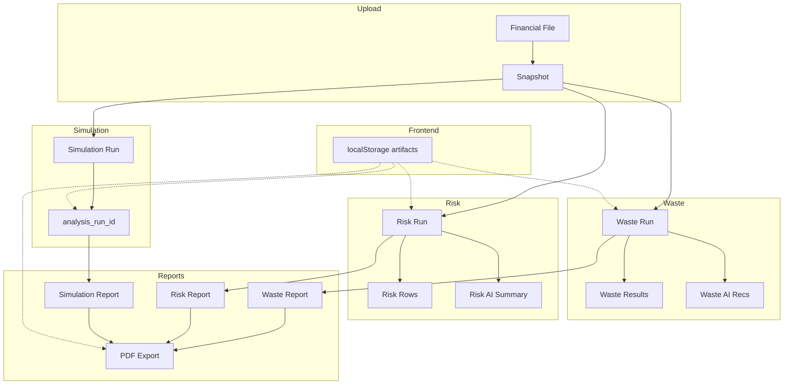

# Enterprise Workflow Trace

**Date:** 2026-07-16  
**Phase:** 1 — Investigation ONLY  
**Purpose:** Trace one uploaded dataset through every layer per LAW workflow

---

## LAW Workflow (Required Order)

```
Login → Upload → Waste → Waste AI → Risk → Risk AI → Simulation → Reports → PDF
→ F5 → New Tab → Browser Restart → Re-upload → Repeat (new data only)
```

---

## End-to-End Object Lifecycle

### Stage 0: Login

| Step | Location | Object | Created | Stored | Read |
|------|----------|--------|---------|--------|------|
| Auth | `POST /auth/login` | JWT + user | Backend | Browser memory / cookie | All API calls |
| Org context | `frontend/lib/org-lookups.tsx` | `organizationId` | Frontend state | React | All pages |

**Loss points:** Logout clears auth only; `localStorage` artifacts **persist** (by design Sprint 1).

---

### Stage 1: Upload Financial File

| Step | Location | Object | Created | Stored | Read |
|------|----------|--------|---------|--------|------|
| Upload | `POST /files/upload` | `FinancialFile` row | Backend | PostgreSQL `financial_files` | Data page |
| Snapshot | Ingest pipeline | `Snapshot` | Backend | `snapshots` | Waste/Risk/Simulation |
| Artifact reset | `registerNewFinancialFile()` | Cleared IDs | Frontend | `localStorage` `khazina_demo_artifacts` | All pages |

**Evidence:** `frontend/lib/demo/state.ts` — `registerNewFinancialFile()` nulls `wasteRunId`, `riskRunId`, `simulationAnalysisRunId`, `lastReportId`, etc.

**Loss points:**
- ✅ Upload clears artifact pointers (Sprint 1)
- ❌ **Risk page UI** does not reset when `riskRunId === null` (KHZ-011) — shows previous React state
- ❌ Waste re-run clears only `lastReportId`, not risk/simulation IDs

---

### Stage 2: Waste Analysis

| Step | Location | Object | Created | Stored | Read |
|------|----------|--------|---------|--------|------|
| Execute | `POST /waste/analyze` | `AnalysisRun` (type=waste) | Backend | `analysis_runs` | Waste page |
| Results | Waste engine | Waste findings | Backend | `waste_analysis_results` | Waste UI, AI facts |
| Pointer | Waste page | `wasteRunId` | Frontend | `localStorage` | Pipeline, reports |

**Trace:** `file_id` → snapshot → waste run → results keyed by `analysis_run_id`

**Loss points:** F5 — waste results reload via `GET /waste/runs/{id}` if `wasteRunId` in localStorage ✅

---

### Stage 3: Waste AI Recommendations

| Step | Location | Object | Created | Stored | Read |
|------|----------|--------|---------|--------|------|
| Generate | `POST /ai/recommendations` | `AiRecommendationRun` | Backend | `ai_recommendation_runs` | Waste page |
| Parse | `recommendation_parser.py` | Items (title, description) | Backend | `ai_recommendation_items` | UI cards |
| Facts | `ContextBuilder` + assemblers | `PromptFact[]` with metric keys | Transient | Prompt only | LLM |
| Pointer | Waste page | `wasteAiReady` | Frontend | `localStorage` | Pipeline |

**Trace:** `wasteRunId` → facts assembly → Cloud AI → parse → DB → `GET /ai/recommendations?analysis_run_id=`

**Loss points:**
- ✅ F5 reload from DB (Sprint 1 fix in `waste-page.tsx`)
- ❌ **Description contains full prompt echo** including `waste.top_category` (RC-2)

---

### Stage 4: Risk Analysis

| Step | Location | Object | Created | Stored | Read |
|------|----------|--------|---------|--------|------|
| Execute | `POST /risk/analyze` | `AnalysisRun` (type=risk) | Backend | `analysis_runs` | Risk page |
| Risks | Risk engine | `Risk` rows | Backend | `risks`, `risk_analysis_results` | Risk UI, AI |
| List | `GET /risks` | Paginated risks | Backend | — | Risk page |
| Pointer | Risk page | `riskRunId` | Frontend | `localStorage` | Reports export |

**Trace:** `file_id` → risk run → engine → Gold persist → `GET /risks?organization_id=&limit=&offset=`

**Failure points (500):**
1. DB missing `risks.lifecycle_status` / `risk_events` (migration not at head)
2. `EngineError` uncaught → 500
3. Missing risk analysis tables

**Loss points:**
- ❌ Re-upload: `riskRunId` cleared but **Risk page UI stale** (KHZ-011)
- ❌ **Not in workflow pipeline** — user can skip to Simulation (KHZ-017)

---

### Stage 5: Risk AI Summary

| Step | Location | Object | Created | Stored | Read |
|------|----------|--------|---------|--------|------|
| Generate | `POST /risk/ai/summary` | AI summary text | Backend | Run metadata / response | Risk page |
| Pointer | Risk page | `riskAiReady` | Frontend | `localStorage` | **Never read for gating** |

**Trace:** `riskRunId` → facts → Cloud AI → display

**Loss points:** F5 — depends on metadata hydration; partial vs waste recs

---

### Stage 6: Scenario Simulation

| Step | Location | Object | Created | Stored | Read |
|------|----------|--------|---------|--------|------|
| Execute | `POST /simulation/run` | `SimulationRun` | Backend | `simulation_runs` | Simulation page |
| Analysis | Linked run | `analysis_run_id` | Backend | `analysis_runs` | Reports |
| Pointer | Simulation page | `simulationAnalysisRunId` | Frontend | `localStorage` | Reports (Sprint 2) |

**Trace:** `file_id` + params → simulation → `analysis_run_id` persisted (Sprint 2)

**Loss points:**
- ❌ Errors swallowed → empty UI (KHZ-020)
- ❌ Pipeline places simulation **before** risk in continue target (wrong order)

---

### Stage 7: Executive Reports

| Step | Location | Object | Created | Stored | Read |
|------|----------|--------|---------|--------|------|
| Generate | `POST /reports/generate` | `Report` + sections | Backend | `reports`, `report_sections` | Reports page |
| List | `GET /reports` | Paginated reports | Backend | — | Reports UI |
| Pointer | Reports page | `lastReportId`, selection | Frontend | `localStorage` + React | Export |

**Trace:** `analysis_run_id` + `title` → builder → sections → report row

**Loss points:**
- ❌ **Duplicate reports** on re-generate (KHZ-026) — no idempotency key
- ❌ Export resolution: risk run ID checked **before** waste (G-02)

---

### Stage 8: PDF Export

| Step | Location | Object | Created | Stored | Read |
|------|----------|--------|---------|--------|------|
| Resolve ID | `resolveExportReportId()` | `report_id` | Frontend | — | Export button |
| Export | `GET /reports/{id}/pdf` | PDF bytes | Backend (transient) | — | Download |

**Trace:** report → sections → `pdf_renderer.py` → bytes

**Loss points:**
- ❌ Wrong report if duplicates + heuristic fallback
- ❌ PDF includes `key_metrics.facts` technical dump (RC-4)
- ❌ Cover business fields skipped when synthetic cover used

---

### Stage 9: Persistence Scenarios

| Scenario | Expected | Actual (evidence) |
|----------|----------|-------------------|
| F5 | All stages reload from DB via artifact IDs | Waste AI ✅; Risk partial; Simulation if ID present |
| New tab | Same as F5 (shared localStorage) | ✅ IDs shared; ❌ React state not synced until navigation |
| Browser restart | localStorage survives | ✅ |
| Logout/login | Artifacts may reference old org | ⚠️ Not cleared on logout |
| Re-upload | All pointers reset; UI shows new data only | ⚠️ Upload clears IDs; Risk UI stale; cross-domain IDs may linger on partial re-run |

---

## Data Flow Diagram



---

## Where Objects Are Lost / Replaced / Cached

| Object | Lost when | Replaced when | Cached |
|--------|-----------|---------------|--------|
| `wasteRunId` | Upload, explicit clear | New waste run | localStorage |
| `riskRunId` | Upload | New risk run | localStorage |
| Waste AI items | Never (DB) | New AI run | DB only |
| Reports | Never (DB) | New generate (duplicate rows) | DB |
| React page state | F5, navigation | Re-fetch | Memory only |
| AI prompt facts | After request | N/A | Not persisted (good) |

---

## First Failing Point by User Issue

| Issue | First failure |
|-------|---------------|
| Risk 500 | DB schema OR `risk_service.py` unhandled exception |
| AI leakage | `builder.py:17` metric in prompt → parser stores full body |
| Wrong PDF | `resolveExportReportId()` risk-first OR duplicate reports |
| Stale Risk UI | `risk-page.tsx` missing reset on null `riskRunId` |
| Wrong workflow order | `pipeline.ts` — risk stage absent |

**Phase 1 complete. No code modified.**
