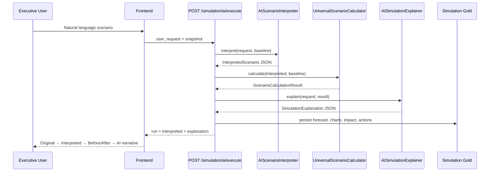

# Sprint 5 — AI-Native Business Simulation

## 1. Root Cause Analysis

The previous Simulation module was **deterministic and preset-driven**, not AI-native:

| Layer | Problem |
|-------|---------|
| **Bootstrap** | Seeded 3 fixed scenarios: «تقليل الإنفاق 10%», «دمج الموردين», «توسع السوق الخليجي» |
| **Frontend** | User entered name/description but execution ignored NL; button showed `تشغيل: ${preset.name}` |
| **API** | `POST /scenarios/{id}/execute` read structured DB assumptions, not user text |
| **ScenarioService** | Docstring: «Deterministic scenario path without AI» |
| **ScenarioArchetype** | Only 3 enums: `spending_reduction`, `supplier_consolidation`, `market_expansion` |
| **Calculator** | Hardcoded formulas with fixed 10%, 5%, 15%, 20%, confidence 88/85/72 |
| **Gold mapper** | Archetype-specific Arabic titles and action templates |

**User NL was never the source of truth.** A request like «أريد رفع الأرباح 200 ألف ريال» had no effect on engine math.

---

## 2. New Architecture (ONLY workflow)

```
User natural language
        ↓
AIScenarioInterpreter (CloudProvider JSON)
        ↓
InterpretedScenario { scenario_type, actions[], assumptions[] }
        ↓
UniversalScenarioCalculator
        ↓
ScenarioCalculationResult (KPIs, charts, impact)
        ↓
AISimulationExplainer (CloudProvider JSON)
        ↓
SimulationExplanation (executive narrative)
        ↓
AISimulationGoldMapper → DB Gold → Frontend
```

### Sequence diagram



---

## 3. Removed Hardcoded Logic

- `scripts/demo/bootstrap.py` — `SCENARIOS = []` (no preset seeding)
- Frontend — removed preset scenario cards, name/description create flow, `تشغيل: ${name}` button text
- Primary execution path — `POST /organizations/{org}/simulation/ai/execute`

Legacy archetype engine remains in codebase for historical tests but is **not** the production workflow.

---

## 4. Files Modified / Added

### Backend (new)
| File | Role |
|------|------|
| `app/scenario/ai_contract.py` | Pydantic contract: `InterpretedScenario`, `ScenarioAction`, `SimulationExplanation` |
| `app/scenario/ai_interpreter.py` | NL → structured JSON via AI |
| `app/scenario/ai_explainer.py` | Results → executive JSON narrative |
| `app/scenario/ai_simulation_service.py` | Orchestrator |
| `app/scenario/exceptions.py` | `ScenarioInterpretationError` |
| `app/business/engines/scenario/universal_calculator.py` | Action-based engine |
| `app/scenario/mappers/ai_gold_mapper.py` | Dynamic Gold payload |
| `app/api/v1/scenario.py` | `POST /simulation/ai/execute` |
| `tests/scenario/test_universal_calculator.py` | 10 scenario unit tests |

### Backend (modified)
| File | Change |
|------|--------|
| `app/schemas/scenario.py` | AI request/response schemas |
| `app/api/deps.py` | `get_ai_simulation_service` |
| `app/core/exception_handlers.py` | 422 handler for interpretation errors |
| `scripts/demo/bootstrap.py` | Empty scenario list |
| `scripts/demo/sprint0_executive_workflow_verify.py` | Uses AI execute |

### Frontend
| File | Change |
|------|--------|
| `components/simulation/simulation-page.tsx` | NL-first UX, AI output panels |
| `lib/api/khazina-api.ts` | `executeAISimulation`, `getAnalysisRun` |
| `lib/api/types.ts` | AI simulation types |

### Scripts
| File | Role |
|------|------|
| `scripts/demo/sprint5_ai_simulation_proof.py` | 10-scenario API proof |

---

## 5. API Contract

**Request** `POST /api/v1/organizations/{org_id}/simulation/ai/execute`

```json
{
  "user_request": "أريد زيادة الأرباح 200 ألف ريال",
  "source_file_id": "...",
  "source_snapshot_id": "...",
  "baseline_analysis_run_id": "..."
}
```

**Response** includes:
- `user_request` — original text
- `interpreted_scenario` — AI-structured JSON
- `ai_explanation` — executive summary, risks, board recommendation, next_actions
- `simulation_run` — Gold run ID for charts/KPIs

---

## 6. Frontend UX

- Single textarea for natural language (Arabic examples in placeholder)
- Button label: **«تشغيل السيناريو»** only — never exposes internal preset names
- Output sections: Original request → AI interpretation → Assumptions → Before/After KPIs → Charts → AI explanation → Next actions

---

## 7. Regression

Run full executive workflow:

```bash
python scripts/demo/sprint0_executive_workflow_verify.py
```

Modules verified: Upload → Waste → Waste AI → Risk → Risk AI → **AI Simulation** → Report → PDF

---

## 8. Manual Proof (10 scenarios)

```bash
python scripts/demo/sprint5_ai_simulation_proof.py
```

Scenarios exercised:
1. زيادة الأرباح 200 ألف ريال
2. خفض المصاريف التشغيلية 15%
3. رفع ميزانية التسويق مليون ريال
4. تقليل الموردين إلى النصف
5. إغلاق أحد الفروع
6. توظيف 20 موظفاً
7. زيادة الرواتب 8%
8. رفع الأسعار 3%
9. خفض تكلفة النقل
10. تقليل الهدر المالي 40%

Results written to `scripts/demo/sprint5_ai_simulation_proof.json`.

---

## 9. Acceptance Criteria Status

| Criterion | Status |
|-----------|--------|
| NL is source of truth | ✅ |
| AI interprets intent (not keywords) | ✅ via CloudProvider |
| Engine consumes JSON not raw text | ✅ |
| Universal action support | ✅ 15 action types |
| AI explains WHY after execution | ✅ |
| No hardcoded preset button labels | ✅ |
| Full output pipeline in UI | ✅ |
